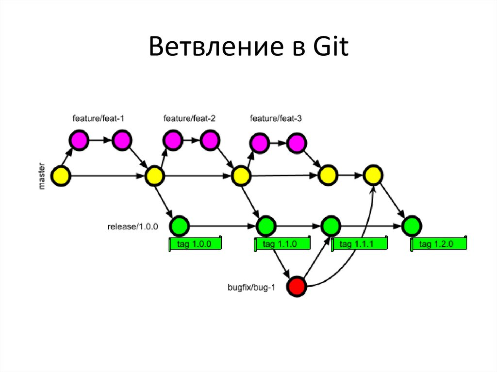

# Инструкция по работе с GIT

LICENSE: [MIT](./license.md)


---

## **Git** - распределенная система управления версиями *(англ. Version Control System)*. Проект был создан Линусом Торвальдсом для управления разработкой ядра Linux, первая версия выпущена 7 апреля 2005 года. На сегодняшний день его поддерживает Джунио Хамано.

## Основные операции:
1. [git config](git%20config.md)
2. [git init](./git%20init.md)
3. [git add](./add.md)
4. [git commit](./git%20commit.md)
5. [git clone](./git%20clone.md)
9. [gitignore](gitignore.md)
___


___

## Создание удаленных репозиториев.
1. [Что такое удаленный репозиторий](./repository-1.md)
2. [Подключение к удаленному репозиторию](./repository2.md)
3. [Отправка изменений на сервер](./repository-3.md)
4. [Запрос изменений сервера](./repository-4.md)

___

## Ветвление

___




Во время разработки новой функциональности считается хорошей практикой работать с копией оригинального проекта, которую называют веткой. Ветви имеют свою собственную историю и изолированные друг от друга изменения до тех пор, пока вы не решаете слить изменения вместе. Это происходит по набору причин:

- Уже рабочая, стабильная версия кода сохраняется.
- Различные новые функции могут разрабатываться параллельно разными программистами.
- Разработчики могут работать с собственными ветками без риска, что кодовая база поменяется из-за чужих изменений.
- В случае сомнений, различные реализации одной и той же идеи могут быть разработаны в разных ветках и затем сравниваться.

1. [Создание новой ветки](./Branching-1.md)
2. [Переключение между ветками](./branching-2.md)
3. [Слияние между ветками](./branching-3.md)


___
## **Удаление ветки в Git**
___
### Как удалять ветки в Git?


Бывают ситуации, когда после слива каких-то изменений из рабочей ветки в исходную версию проекта, ее, по правилам хорошего тона, необходимо удалить, чтобы она более не мешалась в вашем коде. Но как это сделать?
Для локально расположенных веток существует команда:

```bash=
git branch -d local_branch_name

```
где флажок -d являющийся опцией команды **git branch** - это сокращенная версия ключевого слова --**delete**, предназначенного для удаления ветки, а **local_branch_name** – название ненужной нам ветки.

Однако тут есть нюанс: удалить текущую ветку, в которую вы, в данный момент просматриваете - нельзя. Если же вы все-таки попытаетесь это сделать, система отругает вас и выдаст ошибку с таким содержанием:

```bash=
Error: Cannot delete branch local_branch_name checked out at название_директории
```
Так что при удалении ветвей, **обязательно переключитесь на другой branch**.

___
### [Дополнительная информация:](./additionally-1.md)

1. Отслеживание изменений, сделанных в коммитах.
2. Возвращение файла к предыдущему состоянию.
3. Исправление коммита.
4. Разрешение конфликтов при слиянии.
5. Настройка .gitignore.


___
GIT logo by Jason Long - https://twitter.com/jasonlong, license: [Creative Commons Attribution 3.0 Unported] (https://creativecommons.org/licenses/by/3.0/deed.ru)